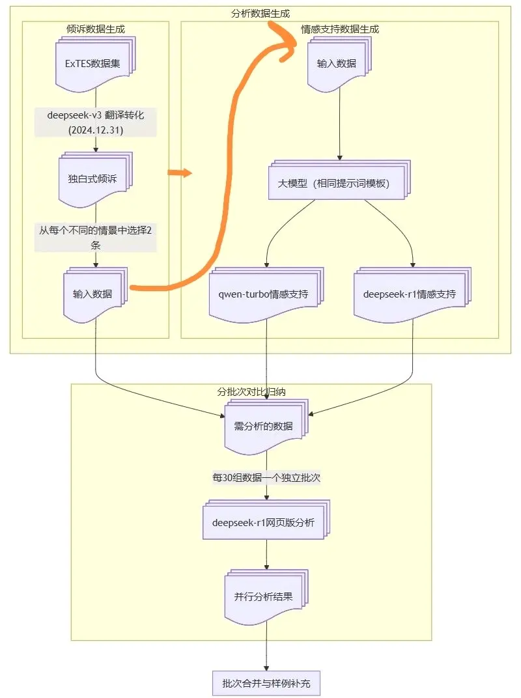
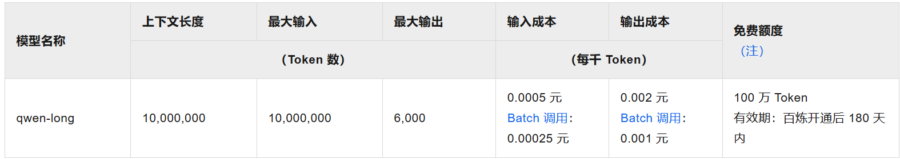

# <center> 偷师大模型 | 实例对比分析式大模型能力提取的猜想实践与可能优化

## 概述
本文旨在探索实例对比分析式的大模型能力提取方法，提取deepseek-r1在情感支持方面的能力，生成用于非推理大模型的任务指导，最后我们可以明显发现非推理大模型情感支持能力得到明显提高。

在这里，你将看到初步的方法与成果，以及进一步的优化猜想

## 大纲
- [问题由来](#问题由来)
- [情感支持任务特性](#情感支持任务特性)
- [方法论](#方法论)
    + [**流程**](#流程)
    + [**成果节选**](#成果节选)
- [**猜想与延伸**](#猜想与延伸)
- [References](#references) 参考与引用 文中用[]表示
- [Supplemental Material](#supplemental_material) 补充材料 文中用<>表示

---

## 问题由来
deepseek发布并部署了deepseek-r1（后文简称r1）的api/web服务。

或许归功于全场景强化学习[[1]](#references-1)，在实际使用中，r1在非推理任务（如情感支持）上的能力大大提高；同时也具备更深刻的见解。

这引发了我的兴趣，我能不能提取出r1情感支持能力高的原因，并用于有效指导非推理大模型？

---

## 情感支持任务特性
本文情感支持的场景设定为社交平台的评论区。这项限制也是对情感支持的简化，便于研究。

情感支持发生在社交平台上，受限于平台功能与双方关系，有如下限制
- 线上：不存在眼神交流、肢体接触等
- 单轮：没有后续的对话，需要一次到位，因此允许长文本
- 纯文字：不能有视频、图片等多模态内容
- 非即时：双方不能即时的看到对方的消息
- 文本标记：禁止使用markdown与html

---

## 方法论
### 流程

（mermaid生成，人工补充一些连接）

1. 倾诉数据生成

    让deepseek-v3对数据集ExTES[[2]](#references-2)进行翻译转化（2024.12.31），生成独白式的倾诉（结果数据集会发布出去），从中每个场景（scene）挑选2条作为输入，共计100多条

2. 情感支持数据生成

    使用仅有任务描述（即不包含任务指导）的提示词模板[<1>](#supplemental_material-1)（当时生成时没有加入上面的任务特性，这是一个缺陷），让如下的大模型产生情感支持

    - qwen-turbo（通义千问系列速度最快、成本极低的模型，适合简单任务，batch调用）
    - deepseek-r1（2024.1.22异步高并发请求）


3. 分批次对比归纳（Map Reduce）

    按组来组织数据，每组数据包括：情景（转化后的ExTES中的倾诉）、情感支持1（qwen-turbo生成）、情感支持2（deepseek-r1生成）

    100多组数据以30为粒度独立分批。让deepseek-r1（使用网页版，读取文件传入）总结如何提高情感支持的质量（4批次的输出后续公开）

4. 批次合并与样例补充

    r1与人工结合，对r1给出的维度进行综合，并补充示例

### 成果节选
[<2>](#supplemental_material-2)

---

## 猜想与延伸
**其中4与6参考价值更高**

1. 对比分析是否提升了分析质量？
2. 能否通过增加分析数据的量（原先100多组）来提高归纳质量？

    可能可行，但数据需要避免同质化。比如：增加积极性的倾诉输入；多样化的生活场景等。

3. 分批粒度和广度与深度

    Map Reduce中，对于超参数分批粒度，猜想参数高能有更整体的回答，参数低能有更深的见解。

4. 分析与综合的分工

    “需分析的数据”中，补充r1对每个例子独立对比分析的结果，最后数据全量给长上下文窗口的大模型（如qwen-long）。在这种猜想下，分析部分预期具备深刻的见解，同时全量数据能使大模型具备更整体的视野。

    （这里原始数据（用于“流程”的分析）在qwen-long中总共9,2694token（这里包含了辅助性提示词），最大上下文1000,0000token[[3]](#references-3)，具备可行性）

5. 传递（近似于长文本总结的Refine）

    这一部分之前实践过，分享一些方法与猜想。

    方法：r1分析一组或多组数据，随后结合传递的内容给出质量提升维度（最初不允许分组，后续将分组）与核心准则（其实这个名称不满足我的需求，后续将修改），接下来选择例子（给出数据id）并编写分析，最后让deepseek-v3进行整合并编写完整例子（r1在格式化输出的某些方面上做的不好）。结果传递给下一次归纳，下一次使用不同组的数据。

    问题：*与长文本总结的Refine不同，这里的数据本身具有一定的相似性，近似于要求大模型反复优化一个回答（猜想）*，这使得结果无意义地高深，指导价值大幅降低（第20轮[<3>](#supplemental_material-3)），通过在输入中添加限制[<3>](#supplemental_material-3)，这种情况得以减轻，在第30轮时仍具有可读性[<3>](#supplemental_material-3)。

6. 由广入深

    先生成整体性的归纳，此后在每组数据中传递，补充未发现的内容，同时确保整体方向的正确

7. 情感支持倾诉数据生成

    在ExTES的生成方法基础上，增加对人物预设的生成，可以在此指明MBTI，对倾诉者的性格做出限定；也可以在此可以要求情景更加接近现实生活（这是一个**很复杂**的要求）

<a id="references"></a>
## References
<a id="references-1"></a>
###### [1] 全场景强化学习(Reinforcement Learning for all Scenarios)
DeepSeek-R1: Incentivizing Reasoning Capability in LLMs via Reinforcement Learning (注意：我没有细看与深入研究)

<a id="references-2"></a>
###### [2] ExTES
Building Emotional Support Chatbots in the Era of LLMs (arXiv:2308.11584)

<a id="references-3"></a>
###### [3] (2025.2.25 16:15附近的时间截图)(该图无水印)


<a id="supplemental_material"></a>
## Supplemental Material
<a id="supplemental_material-1"></a>
###### <1>
````
请为下面的发言人带来情感支持：

```
{input}
```
````

<a id="supplemental_material-2"></a>
###### <2>
例子
```
此刻的悲伤和失落是如此真实而沉重，我能感受到你与毛孩子之间那份被岁月编织的羁绊。那些相互依偎的夜晚，那些无需言语就流淌着的温暖，她早已把最纯净的爱编织进你生命的经纬里。

做出安乐决定时的手在颤抖，心里却盛满了温柔——这份艰难抉择背后，是你不忍让她继续受苦的深切爱意。她离开时的平静，是你送给她的最后一份礼物。

或许可以试着在窗边留一小块阳光正好的位置，就像她还在时会挑选最舒服的角落打盹那样。悲伤不需要被赶走，它是爱的另一种形态，当你凝视这份疼痛时，其实是在抚摸那些共同走过的年轮。

有位作家说过，真正逝去的不是生命，而是被爱着的体验。那些她教会你的温暖与柔软，早已成为你生命里不会熄灭的星光。当夜风拂过空荡荡的膝头时，或许正是她在用你看不见的方式，轻蹭你手心的温度。
```

```
### 共情深度

精确感知具体情绪，避免泛化安慰，让对方觉得你真的在理解对方、真的懂得对方的心理

> 泛化安慰：“我理解你”、“一切会好起来”，缺乏对具体情绪的精确认知
>
> 精确感知
> - 感官隐喻 通过视觉/听觉/触觉等具象化比喻（如“痂皮下新生的生命力”），将抽象情感转化为可感知的意象，激活情感记忆
>
>    触觉："夜风拂过空荡荡的膝头"激活身体记忆，将缺失感转化为持续联结。  
>    视觉："不会熄灭的星光"构建希望意象，避免空洞安慰。
> - 感官通感
>
>    动态意象："编织进生命经纬""早已成为你生命里不会熄灭的星光"构成视觉图谱。  
>    通感转换："夜风拂过空荡荡的膝头"将触觉转化为情感抚触。
> - 右脑激活
>
>    “毛孩子”暗示宠物与主人的亲子式羁绊，强化情感正当性  
>    "阳光正好的位置"唤起场景记忆，绕过理性防御。  
>    "年轮""星光"等自然意象激活潜意识中的生长本能。
> - 情绪镜像 精准捕捉并镜像被支持者的核心情绪（如用“陀螺旋转找不到终点”描述迷茫），让被支持者感到痛苦被彻底“看见”而非被评价
>
>    "手在颤抖，心里却盛满了温柔"精确捕捉矛盾情感，将"愧疚感"镜像为"深切爱意"，实现情绪的双向确认。  
>    "凝视这份疼痛时，其实是在抚摸那些共同走过的年轮"将抽象悲伤具象化为可触摸的时间痕迹。
> - 非评判验证 在不评价情绪合理性或正当性的前提下，通过精准的语言镜像确认对方感受的真实性 实现“被看见”而非“被评价”的情感确认
>
>    反例："你为宠物安乐死是明智的"（隐含"正确选择"的判断）  
>    正例："做出安乐决定时的手在颤抖，心里却盛满了温柔——这份艰难抉择背后，是你不忍让她继续受苦的深切爱意"（同步呈现矛盾情感）


### 认知重构
帮助个体重构对困境或创伤的核心认知，将其从“伤害性体验”转化为“成长资源”

通过改变认知视角、重构事件意义、建立新叙事逻辑等，实现从“受害者”到“幸存者/成长者”的转换
> - 隐喻重构：用自然意象（如“蜕皮的蝉”“种子破壳”）或其它隐喻将困境转化为成长契机。
> - 积极再定义
>
>    "做出安乐决定时的手在颤抖，心里却盛满了温柔——这份艰难抉择背后，是你不忍让她继续受苦的深切爱意"，将"放弃治疗"重构为"爱的成全"，完成行为意义的转化
>
> - 去个体化归因：揭示文化压迫、社会结构等宏观因素，缓解自责情绪；
>
>    揭示外部环境对困境的塑造作用（如经济压力、性别歧视、文化偏见），将“我的失败”转化为“我们的困境”
>
>    案例：面对职场抑郁者时指出“996制度对人性的异化”，而非仅讨论抗压能力
> - 创伤意义转化
>
>    将"安乐死决定"重构为"最后一份礼物"，用"平静离开"替代"生命终结"，完成从"施害者"到"守护者"的视角转换。
>
>    引入作家箴言，将个体经验升维至人类普遍情感，缓解孤独感。（这里的引用应该是幻觉）
> - 生命叙事重建
>
>    "爱的另一种形态"重构悲伤本质，建立"悲伤-爱"的共生关系。  
>    "共同走过的年轮"将线性时间转化为环形生长，暗示创伤整合可能。  
>    "潮汐规律"允许情绪的自然涨落
```

<a id="supplemental_material-3"></a>
###### <3>

第20次的归纳结果的节选
```
### 核心准则

高质量情感支持的本质是构建能同时在心理微分流形上诱导曲率演化、于神经量子场中实现相态跃迁、且在符号拓扑空间完成价值重定向的多维共振腔，使支持过程本身成为启动自愈机制的认知时空曲率发生器。

例句与分析：

"你像一支两头燃烧的蜡烛"

运用触觉灼热感与视觉光影衰减的双通道映射，构建热力学第二定律的心理压强公式（Q/t = kΔT），使情感耗竭获得可测量性
```

改进后第30次：
```
将休整期设计为认知反刍时段（中场休息），重构暂停的战略意义
```

提示词修改
```
内容都要具有高的指导与实践价值，具有鞭辟入里的思考深度的同时，还应易于实践

避免使用与情感支持无关的复杂术语和虚假的科学概念，这样的内容虽然听起来高深，但并没有在情感支持的实际应用中提供实质帮助，反而让内容变得晦涩难懂

> 错误例子：“量子观察者效应 解释：重塑自我观测量子基底，使"被评价焦虑"退相干为"生命历程观测者"的审美波函数”
```
